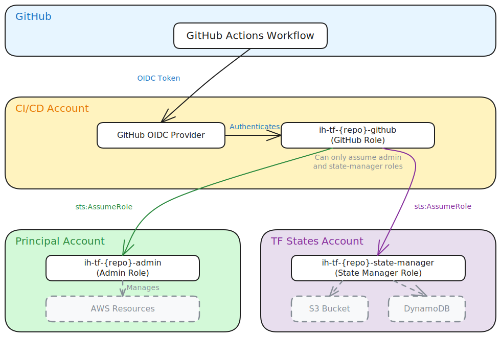

# terraform-aws-gha-admin

[](https://infrahouse.com/contact)
[](https://infrahouse.github.io/terraform-aws-gha-admin/)
[](https://registry.terraform.io/modules/infrahouse/gha-admin/aws/latest)
[](https://github.com/infrahouse/terraform-aws-gha-admin/releases/latest)
[](https://github.com/infrahouse/terraform-aws-gha-admin/actions/workflows/vuln-scanner-pr.yml)
[](LICENSE)

[](https://aws.amazon.com/iam/)


A Terraform module that creates IAM roles for GitHub Actions CI/CD in a multi-account AWS environment
using OpenID Connect (OIDC) authentication — no long-lived AWS credentials needed.

## Why This Module?

Setting up GitHub Actions to manage AWS infrastructure across multiple accounts requires careful
IAM configuration: OIDC trust policies, cross-account role assumption, least-privilege permissions,
and Terraform state access. Getting this wrong can lead to security vulnerabilities or broken CI/CD pipelines.

**Key benefits:**

- **No long-lived credentials**: Uses GitHub OIDC for authentication instead of static access keys
- **Multi-account ready**: Designed for proper account separation (CI/CD, principal, TF states)
- **Least privilege**: GitHub Actions can only assume specific roles, not arbitrary AWS permissions
- **State management included**: Automatically creates a role for Terraform state access via the
  [state-manager](https://registry.infrahouse.com/infrahouse/state-manager/aws) submodule

## Features

- **Three-role architecture**: Admin, GitHub, and State Manager roles with clear separation of concerns
- **GitHub OIDC integration**: Secure authentication tied to specific GitHub organization and repository
- **Configurable admin policy**: Default AdministratorAccess or custom restricted policy
- **Cross-account role assumption**: GitHub role in CI/CD account assumes roles in other accounts
- **Additional trusted ARNs**: Allow extra principals to assume admin and state-manager roles
- **Assume-all mode**: Optional ability for the GitHub role to assume any role (for central CI/CD repos)
- **Configurable session duration**: Up to 12 hours by default for long-running Terraform operations

## Documentation

For detailed documentation, visit the
[GitHub Pages documentation site](https://infrahouse.github.io/terraform-aws-gha-admin/).

- [Getting Started](https://infrahouse.github.io/terraform-aws-gha-admin/getting-started/)
- [Architecture](https://infrahouse.github.io/terraform-aws-gha-admin/architecture/)
- [Configuration Reference](https://infrahouse.github.io/terraform-aws-gha-admin/configuration/)
- [Examples](https://infrahouse.github.io/terraform-aws-gha-admin/examples/)
- [Troubleshooting](https://infrahouse.github.io/terraform-aws-gha-admin/troubleshooting/)

## Quick Start

### Prerequisites

1. A GitHub OIDC provider in your CI/CD account
   (use [gh-identity-provider](https://registry.infrahouse.com/infrahouse/gh-identity-provider/aws)):

    ```hcl
    module "github-connector" {
      source  = "registry.infrahouse.com/infrahouse/gh-identity-provider/aws"
      version = "1.1.1"
    }
    ```

2. An S3 bucket and DynamoDB table for Terraform state
   (use [state-bucket](https://registry.infrahouse.com/infrahouse/state-bucket/aws)):

    ```hcl
    module "state-bucket" {
      source  = "registry.infrahouse.com/infrahouse/state-bucket/aws"
      version = "2.2.0"
      providers = {
        aws = aws.tf-states
      }
      bucket = "my-org-terraform-states"
    }
    ```

### Deploy the Module

```hcl
module "gha" {
  source  = "registry.infrahouse.com/infrahouse/gha-admin/aws"
  version = "3.5.1"
  providers = {
    aws          = aws
    aws.cicd     = aws.cicd
    aws.tfstates = aws.tfstates
  }
  gh_org_name               = "my-org"
  repo_name                 = "my-repo"
  state_bucket              = module.state-bucket.bucket_name
  terraform_locks_table_arn = module.state-bucket.lock_table_arn
}
```

The module requires three AWS provider aliases for the three accounts:

- `aws` — the principal account where managed resources live
- `aws.cicd` — the CI/CD account where the GitHub OIDC provider is configured
- `aws.tfstates` — the account where Terraform state is stored

## Usage

See the architecture diagram for how the three roles interact:



The three IAM roles created:

- `ih-tf-{repo_name}-admin` — manages AWS resources in the principal account
  (default: AdministratorAccess policy)
- `ih-tf-{repo_name}-state-manager` — manages Terraform state in the TF states account
- `ih-tf-{repo_name}-github` — assumed by GitHub Actions via OIDC, can only assume
  the admin and state-manager roles

It's up to the module user to decide what the `*-admin` role can do.
Pass a custom `admin_policy_name` to restrict permissions according to your security practices.

<!-- BEGIN_TF_DOCS -->

## Requirements

| Name | Version |
|------|---------|
| <a name="requirement_terraform"></a> [terraform](#requirement\_terraform) | ~> 1.5 |
| <a name="requirement_aws"></a> [aws](#requirement\_aws) | >= 5.11, < 7.0 |

## Providers

| Name | Version |
|------|---------|
| <a name="provider_aws"></a> [aws](#provider\_aws) | >= 5.11, < 7.0 |
| <a name="provider_aws.cicd"></a> [aws.cicd](#provider\_aws.cicd) | >= 5.11, < 7.0 |

## Modules

| Name | Source | Version |
|------|--------|---------|
| <a name="module_state-manager"></a> [state-manager](#module\_state-manager) | infrahouse/state-manager/aws | 1.4.2 |

## Resources

| Name | Type |
|------|------|
| [aws_iam_policy.github](https://registry.terraform.io/providers/hashicorp/aws/latest/docs/resources/iam_policy) | resource |
| [aws_iam_policy.github-assume-all](https://registry.terraform.io/providers/hashicorp/aws/latest/docs/resources/iam_policy) | resource |
| [aws_iam_role.admin](https://registry.terraform.io/providers/hashicorp/aws/latest/docs/resources/iam_role) | resource |
| [aws_iam_role.github](https://registry.terraform.io/providers/hashicorp/aws/latest/docs/resources/iam_role) | resource |
| [aws_iam_role_policy_attachment.admin](https://registry.terraform.io/providers/hashicorp/aws/latest/docs/resources/iam_role_policy_attachment) | resource |
| [aws_iam_role_policy_attachment.github](https://registry.terraform.io/providers/hashicorp/aws/latest/docs/resources/iam_role_policy_attachment) | resource |
| [aws_iam_role_policy_attachment.github-assume-all](https://registry.terraform.io/providers/hashicorp/aws/latest/docs/resources/iam_role_policy_attachment) | resource |
| [aws_iam_openid_connect_provider.github](https://registry.terraform.io/providers/hashicorp/aws/latest/docs/data-sources/iam_openid_connect_provider) | data source |
| [aws_iam_policy.admin](https://registry.terraform.io/providers/hashicorp/aws/latest/docs/data-sources/iam_policy) | data source |
| [aws_iam_policy_document.admin-trust](https://registry.terraform.io/providers/hashicorp/aws/latest/docs/data-sources/iam_policy_document) | data source |
| [aws_iam_policy_document.github-permissions](https://registry.terraform.io/providers/hashicorp/aws/latest/docs/data-sources/iam_policy_document) | data source |
| [aws_iam_policy_document.github-permissions-assume-all](https://registry.terraform.io/providers/hashicorp/aws/latest/docs/data-sources/iam_policy_document) | data source |
| [aws_iam_policy_document.github-trust](https://registry.terraform.io/providers/hashicorp/aws/latest/docs/data-sources/iam_policy_document) | data source |

## Inputs

| Name | Description | Type | Default | Required |
|------|-------------|------|---------|:--------:|
| <a name="input_admin_policy_name"></a> [admin\_policy\_name](#input\_admin\_policy\_name) | Name of the IAM policy the `ih-tf-{var.repo_name}-admin` role will have. This is what the role can do. | `string` | `"AdministratorAccess"` | no |
| <a name="input_allow_assume_all_roles"></a> [allow\_assume\_all\_roles](#input\_allow\_assume\_all\_roles) | If true the -github role may assume all possible roles. | `bool` | `false` | no |
| <a name="input_allowed_arns"></a> [allowed\_arns](#input\_allowed\_arns) | A list of ARNs `ih-tf-{var.repo_name}-github` is allowed to assume<br/>besides `ih-tf-{var.repo_name}-admin` and `ih-tf-{var.repo_name}-state-manager` roles. | `list(string)` | `[]` | no |
| <a name="input_gh_org_name"></a> [gh\_org\_name](#input\_gh\_org\_name) | GitHub organization name. | `string` | n/a | yes |
| <a name="input_max_session_duration"></a> [max\_session\_duration](#input\_max\_session\_duration) | Maximum session duration (in seconds) that you want to set for the specified role. | `number` | `43200` | no |
| <a name="input_repo_name"></a> [repo\_name](#input\_repo\_name) | Repository name in GitHub. Without the organization part. | `string` | n/a | yes |
| <a name="input_state_bucket"></a> [state\_bucket](#input\_state\_bucket) | Name of the S3 bucket with the state | `string` | n/a | yes |
| <a name="input_terraform_locks_table_arn"></a> [terraform\_locks\_table\_arn](#input\_terraform\_locks\_table\_arn) | DynamoDB table that holds Terraform state locks. | `string` | n/a | yes |
| <a name="input_trusted_arns"></a> [trusted\_arns](#input\_trusted\_arns) | A list of ARNs besides `ih-tf-{var.repo_name}-github` that are allowed to assume<br/>the `ih-tf-{var.repo_name}-admin` and `ih-tf-{var.repo_name}-state-manager` role. | `list(string)` | `[]` | no |

## Outputs

| Name | Description |
|------|-------------|
| <a name="output_admin_role_arn"></a> [admin\_role\_arn](#output\_admin\_role\_arn) | ARN of the `ih-tf-{var.repo_name}-admin` role |
| <a name="output_github_role_arn"></a> [github\_role\_arn](#output\_github\_role\_arn) | ARN of the `ih-tf-{var.repo_name}-github` role |
| <a name="output_state_manager_role_arn"></a> [state\_manager\_role\_arn](#output\_state\_manager\_role\_arn) | ARN of the `ih-tf-{var.repo_name}-state-manager` role |
<!-- END_TF_DOCS -->

## Contributing

See [CONTRIBUTING.md](CONTRIBUTING.md) for guidelines on how to contribute to this project.

## License

This project is licensed under the Apache 2.0 License. See [LICENSE](LICENSE) for details.
