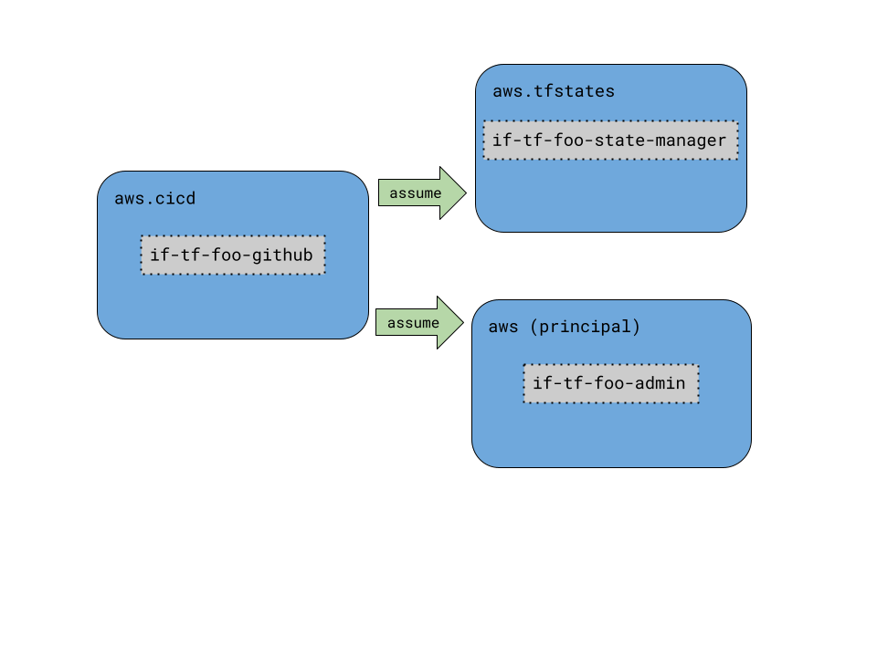

# Module terraform-aws-gha-admin

## IAM Roles for Terraform CI/CD

There are three IAM roles in the multi-account environment used by the CI/CD system.  



## AWS accounts

* `aws.cicd` - account for CI/CD components.
* `aws.tfstates` - account for Terraform state buckets, a DynamoDB lock table, and IAM roles to manage the states.
* `aws` - a principal account under the Terraform management.

## IAM Roles

The module creates three IAM roles:

* `ih-tf-{var.repo_name}-admin` - the role that has permissions to manage AWS resources. 
  The role is created in the "principal" AWS account.
* `ih-tf-{var.repo_name}-state-manager` - the role can upload/download a Terraform state. 
  The role is created in the "TF states" account by 
  the [state-manager](https://registry.terraform.io/modules/infrahouse/state-manager/aws/latest) module.
* `ih-tf-{var.repo_name}-github` - the role can only assume the `ih-tf-{var.repo_name}-admin` role. The role is
  The role is created in the CD/CD account.

It's up to a module user to decide what the `*-admin` role can do.
By default, it will have the `AdministratorAccess` policy attached, but you might want to pass a limited
policy accordingly to your security practices.

The module requires a GitHub OpenID connector to be created. The [gh-identity-provider
](https://registry.terraform.io/modules/infrahouse/gh-identity-provider/aws/latest) module can do it for you.

## Usage

### Pre-requisites

Make sure the GitHub connector is created. The GitHub OpenID connector
must be created in the CI/CD account, where the "*-github" role is.

```hcl
module "github-connector" {
  source  = "infrahouse/gh-identity-provider/aws"
  version = "~> 1.0"
}
```

A Terraform state bucket. You can use any module that would create a states bucket. 
The recommended bucket configuration is described in https://blog.gruntwork.io/how-to-manage-terraform-state-28f5697e68fa

For sake of example, here's a snippet, but don't use it in production. 
```hcl
resource "aws_s3_bucket" "pytest" {
  bucket_prefix = "pytest-gha-"
}
```

Finally, a DynamoDB table. It's used for the Terraform state locks. The state locks are optional 
and not required by Terraform itslef. The gha-admin module though requires it.
```hcl
resource "random_pet" "dynamo" {
  prefix = "pytest-gha-"
}

resource "aws_dynamodb_table" "terraform_locks" {
  name         = random_pet.dynamo.id
  billing_mode = "PAY_PER_REQUEST"
  hash_key     = "LockID"
  attribute {
    name = "LockID"
    type = "S"
  }
}
```

### gha-admin module

Now create the roles for GitHub Actions. Note that module requires three providers. 
Each of them is supposed to describe different AWS accounts.   

```hcl
module "gha" {
  providers = {
    aws          = aws
    aws.cicd     = aws.your-cicd-provider
    aws.tfstates = aws.your-tf-states-provider
  }
  source                    = "infrahouse/gha-admin/aws"
  version                   = "~> 2.0"
  gh_org_name               = "infrahouse"
  repo_name                 = "aws-control-493370826424"
  state_bucket              = "infrahouse-aws-control-493370826424"
  terraform_locks_table_arn = aws_dynamodb_table.terraform_locks.arn

}
```
* 
* `gh_org_name` is `infrahouse` as in https://github.com/infrahouse.
* `repo_name` is `aws-control-493370826424` as in https://github.com/infrahouse/aws-control-493370826424.
* `gha` is a Terraform root module, so it creates actual resources and stores a Terraform state
in `state_bucket` which is `s3://infrahouse-aws-control-493370826424`.

